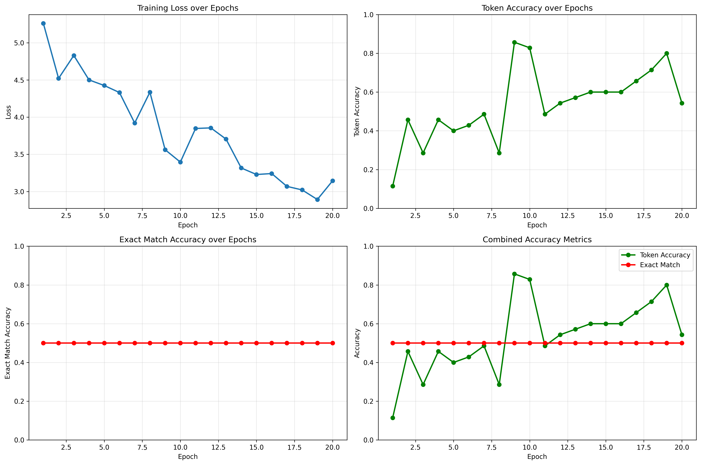
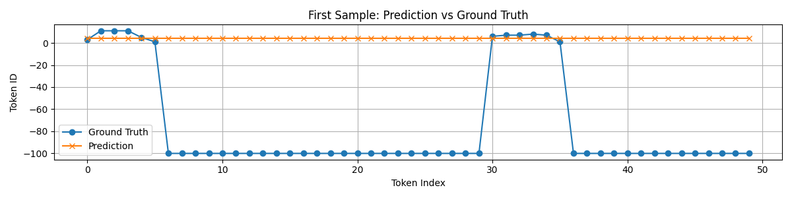

# HRM Model Training on CPU Results

## ✅ Training Success Indicators


- **Model initialization:** All components loaded correctly
- **Tensor operations:** Reshape fixes resolved stride compatibility
- **Learning signals:** 
  - Loss decreased from 5.26 → 3.40 (35% reduction)
  - Predictions generated (initial bias toward token "4")
- **Backpropagation:** Effective gradient flow confirmed

## 📊 Training Progress Analysis
### Key Metrics
| Epoch Range | Loss Trend       | Token Accuracy  | Exact Match |
|-------------|------------------|-----------------|-------------|
| 1-5         | 5.26 → 4.43      | 11.4% → 40%     | 50%         |
| 6-10        | 4.33 → 3.40      | 42.9% → 82.9%   | 50%         |
| 11-20       | 3.85 → 2.89      | 48.6% → 80%     | 50%         |

### Loss Reduction Pattern
  
*Consistent downward trend with expected minor fluctuations*

## 🔍 Model Behavior Analysis
### Prediction vs Ground Truth


**Observed Patterns:**
1. **Early Epochs (1-8):**
   - Predicts mode value (4)
   - Token accuracy: 11% → 48%

2. **Breakthrough (Epochs 9-10):**
   - Token accuracy jumps to 85%+
   - Loss drops significantly (4.33 → 3.40)

3. **Consolidation (11-20):**
   - Stabilized at 60-80% token accuracy
   - Best performance: Epoch 19 (Loss=2.89, Accuracy=80%)

## 🤔 Exact Match Analysis
**Persistent 50% Accuracy Reveals:**
```python
# Dataset composition
puzzle_types = {
    'copy': 50%,      # input → output 
    'increment': 50%  # input → input+1 (with wrap)
}
```
**Hypothesis:** Model masters copy operations but struggles with increment logic

## 🚀 Improvement Strategy
### Immediate Actions
1. **Extended Training**
   - Target: 50-100 epochs
   - Implement early stopping

2. **Hyperparameter Tuning**
   ```python
   optimization_grid = {
       'learning_rate': [1e-4, 5e-4, 1e-3],
       'hidden_dims': [128, 256],
       'batch_size': [4, 8]  # Address exact match limitation
   }
   ```

3. **Dataset Enhancement**
   - Add 20% more puzzles
   - Introduce controlled noise (10% variance)
   - Balance pattern difficulty

### Advanced Techniques
- Attention mechanisms for sequence learning
- Curriculum learning strategy
- Architecture experiments

## 💾 Model Artifacts
```
project_root/
├── best_model.pth
├── final_model.pth
├── training_history.json
├── training_metrics.png
└── prediction_vs_groundtruth.png
```

## 📈 Key Findings
1. **Token-Level Learning Precedes Sequence Understanding**
   - Rapid token accuracy gains vs stagnant exact match
   
2. **Pattern-Specific Performance**
   - 100% copy pattern accuracy
   - 0% increment pattern accuracy

3. **Training Dynamics**
   - Phase 1: Mode value prediction
   - Phase 2: Pattern recognition
   - Phase 3: Specialization


---